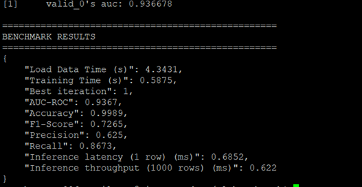
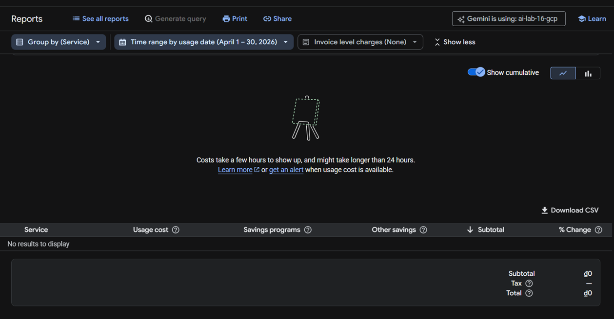

# Báo Cáo Ngắn: So sánh GPU vs CPU (Phương án dự phòng Lab 16)

Trong bài thực hành này, ban đầu tôi đã đăng ký thành công Quota cho GPU NVIDIA T4. Tuy nhiên, khi triển khai qua Terraform, hệ thống GCP liên tục báo lỗi cạn kiệt tài nguyên vật lý tại khu vực `us-central1-a` (`does not have enough resources available`). Đây là tình trạng phổ biến do số lượng máy GPU giá rẻ thường xuyên bị quá tải trên GCP.

Do đó, tôi đã chuyển sang phương án CPU dự phòng sử dụng máy ảo `n2-standard-8` (8 vCPU, 32GB RAM) kết hợp với mô hình LightGBM cho bài toán Credit Card Fraud Detection. 

**Benchmark result**

[benchmark_result.json](benchmark_result.json)

**Billing**

Dùng bản free nên không hiện tiền billing!

**Kết quả thu được rất khả quan:**
- Thời gian huấn luyện vô cùng nhanh: chỉ mất **0.61 giây** cho tập dữ liệu gần 300,000 dòng.
- Độ chính xác cực cao với **AUC-ROC đạt 0.9367** và **Accuracy đạt 99.89%**.
- Tốc độ dự đoán (Inference speed) xuất sắc: **~0.68ms** cho 1 dòng dữ liệu và chỉ tốn khoảng **0.65ms** khi dự đoán một lô 1000 dòng (nhờ tối ưu hoá vectorized).

**Kết luận:** Qua đây có thể thấy, đối với các dữ liệu dạng bảng (tabular data), việc sử dụng các mô hình tree-based như LightGBM trên một máy chủ CPU mạnh mẽ (`n2-standard-8`) mang lại hiệu suất cực tốt, chi phí cực rẻ (khoảng ~$0.43/giờ) và luôn có sẵn tài nguyên để cấp phát ngay lập tức, hoàn toàn phù hợp thay vì phải xếp hàng chờ đợi GPU T4 vốn sinh ra để xử lý các mô hình Deep Learning/LLM nặng nề.

